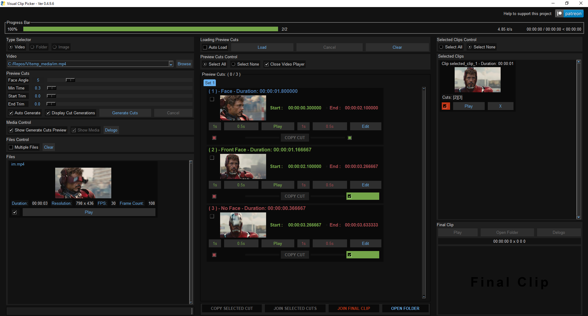
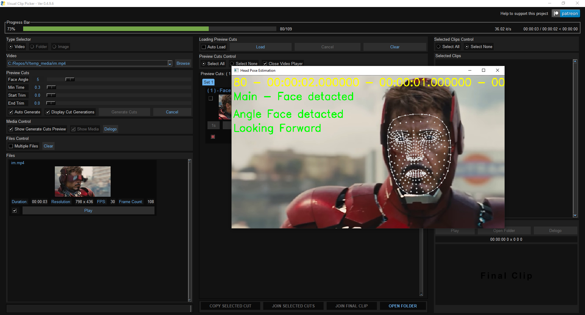

## Visual Clip Picker: Trimming Clips by Face Recognition


### [Video demo](https://youtu.be/zCkc9-PspAU)





Another small old project of mine.

An video editor that utilizes Google's MediaPipe. This project can segment videos based on face detection or face angle. It helps extract scenes with humans, scenes without humans, scenes without a face, scenes with a face, and faces based on angles threshold.

It is built mainly for face swapping, so it prioritizes front face angle, but you can play with settings.


Impotent to note that MediaPipe got issues with detecting small or far away faces, this can be can improve by trying better methods, model or replace MediaPipe with another detector. i haven't play with it for the last year so we will see.


Additionally Visual Clip Picker allows you to stitch these segments back together in very specific timing.

In the future it can detects all kind of of objects, specific objects, specific person and so on, i will add those based on interest and time.

You can cut multiple videos, **but for this make sure you don't check "Auto Generate"
and "Display Cut Generations"**

**After Multiple video cutting is ended make sure you uncheck "Multiple Files"**

**And make sure you load one video at time, or else it will bug the UI.**

**Make sure you don't cut more then 300 cuts, or it might bug the UI depends on system.**

Need to make a guide.

ill try to fix it in the future but videos, python and GUI don't get along very well.

There are more bugs that need to fixed, report them so i can fix the priority ones.

Tell me what you think, and if you find it useful, what can be improved and so on, ill add them slowly.

### Requirements: windows 10,11

### Download:

```
git clone https://github.com/diStyApps/VisualClipPicker.git
```
Or download the Source code: [Releases](https://github.com/diStyApps/VisualClipPicker/releases)

Install 


``Double click on Install.bat``


Run

``Double click on Run.bat``


Support this project: https://www.patreon.com/distyx
